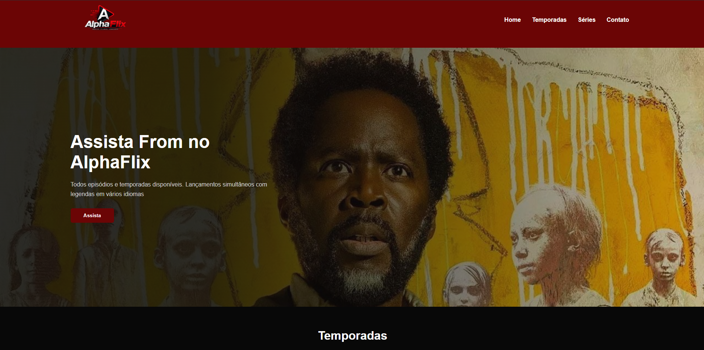

# 🎬 AlphaFlix

AlphaFlix é uma landing page inspirada em plataformas de streaming, desenvolvida como projeto prático durante meus estudos de Front-End.

O projeto apresenta uma interface moderna para divulgação da série *From*, incluindo banner principal, catálogo de temporadas, área promocional e rodapé com links de navegação e redes sociais.

## 🚀 Tecnologias Utilizadas

- HTML5  
- CSS3  
- Flexbox  
- Gradientes CSS  
- Transições e efeitos hover  
- Organização de layout com CSS moderno  
- Git e GitHub  

## 📋 Funcionalidades

- Navbar com logo e menu de navegação  
- Hero Section com imagem de destaque  
- Catálogo de temporadas em cards  
- Banners promocionais  
- Rodapé com links rápidos e redes sociais  
- Efeitos de hover em botões e links  

## 🎨 Layout

O design foi inspirado em plataformas de streaming modernas, utilizando:

- Tema escuro  
- Destaques em vermelho  
- Estrutura organizada com Flexbox  
- Imagens de fundo e cards visuais  
- Estilização com foco em UI moderna  

## 📚 Aprendizados

Durante o desenvolvimento deste projeto, foram praticados conceitos como:

- Estruturação semântica com HTML  
- Organização de layouts com Flexbox  
- Posicionamento de elementos  
- Uso de imagens de fundo com CSS  
- Estilização avançada  
- Transições e interações com hover  

## 🔧 Melhorias Futuras

- Tornar o layout totalmente responsivo  
- Adicionar páginas individuais para cada temporada  
- Implementar JavaScript para interatividade  
- Criar sistema de busca  
- Melhorar acessibilidade  

## 📸 Preview do Projeto

## 👨‍💻 Autor

Desenvolvido por Cesar Alves como projeto de estudos em Desenvolvimento Front-End.